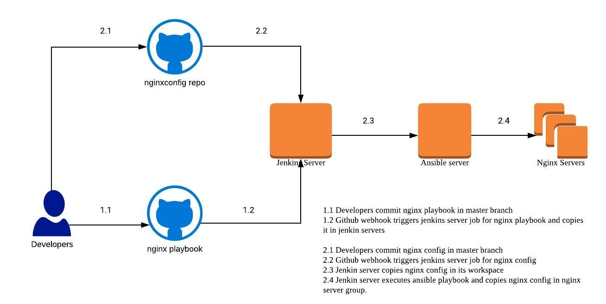

# Introduction

This repository contain code to demonstrate a CICD pipeline for nginx configuration.

## Infrastructure used are  
1. Jenkins
2. Ansible
3. Github webhooks
4. ansiblejenkins repo which is this repo itself
5. nginxconfig repo at nkumar15/nginxconfig for nginx configuration
6. 2 Amazon linux EC2 instances
7. ssh key to login into instances

## Infrastructure setup
1. SSH Login into an ec2-machine which will be used as jenkins server  
   execute `jenkins.sh` script to install jenkins.
2. Use same machine for ansible.  
   execute `ansible.sh` script to install ansible.
3. Setup webhook in your github repositories as mentioned here.  
   https://developer.github.com/webhooks/creating/

Above steps will bring up the infrastructure

## Ansible configuration
1. create a server group in `/etc/ansible/host` named [nginxservers] and provide other ec2 instance ip address as eg shown below.  
`[nginxservers]`  
`your other ec2 ip here`

## Jenkins user and ssh key configuration
1. Ansible needs to use ssh key to login to other system. By default this ssh key may have owner as `ec2-user`. This will not allow jenkins user to read ssh keys. To overcome this we will add jenkins users in sudoers group as suggested below. In your jenkins ec2 instance  
`sudo visudo`  
Now go to the last line of file and add below statement.  
`username     ALL=(ALL) NOPASSWD:ALL`

2. Copy your ssh key in ec2 instance and change its permission as suggested below  
`chmod 600 </path/to/yoursshkey>`

## Architecture Digram

